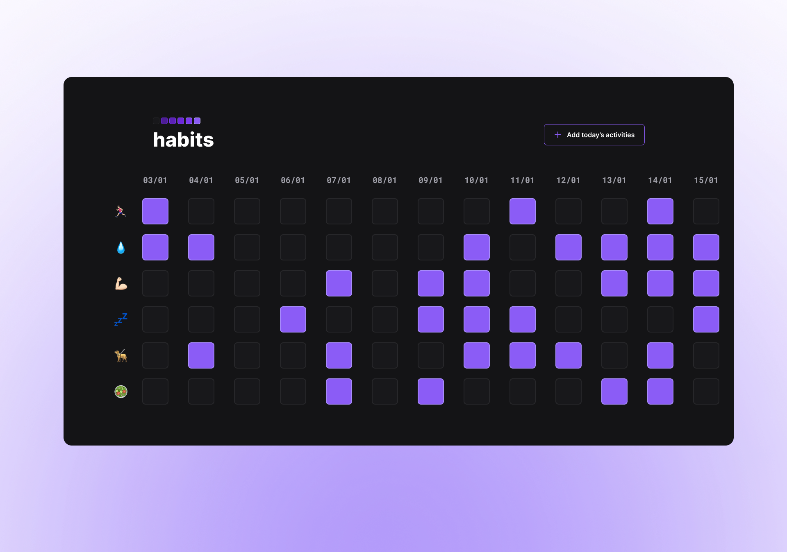

<h1 align="center"> Habits </h1>

Habits is a web application for registering daily activities and keeping track of their recurrence in order to build healthy habits that will lead to a better life.  

  <a href="#technologies">Technologies</a>&nbsp;&nbsp;&nbsp;|&nbsp;&nbsp;&nbsp;
  <a href="#project">Project</a>&nbsp;&nbsp;&nbsp;|&nbsp;&nbsp;&nbsp;
  <a href="#layout">Layout</a>&nbsp;&nbsp;&nbsp;|&nbsp;&nbsp;&nbsp;

 

  

## Technologies

This project was developed using:

- HTML e CSS
- JavaScript
- Git e Github
- Figma

## Project

The Habits project was made during Rocketseat's NLW event in jan/23.

👉 You can test and use the app online [HERE](https://gazoland.github.io/habits-app).

## Layout

You can view the project's layout through [THIS LINK](https://www.figma.com/community/file/1187422022288947321). You must be registered on [Figma](https://figma.com) to access it.
